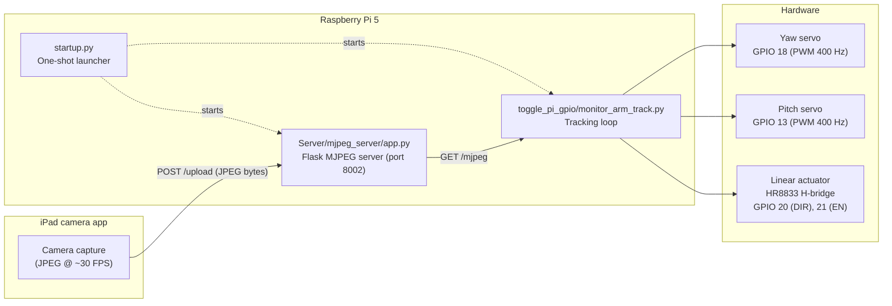
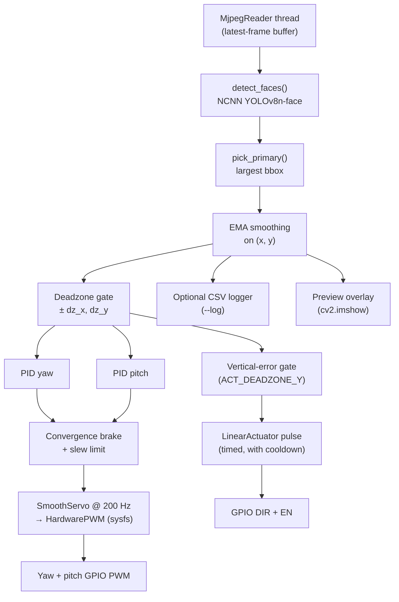

# Head-Tracking Monitor Arm — Raspberry Pi 5 Code

Companion code repository for the BEng dissertation *Head-Tracking Monitor Arm*
(Junbyung Park, 10936972, EEEN30330, 2025/26).

## 1. Introduction

This repository contains the on-device software that runs on a Raspberry Pi 5
inside the head-tracking monitor arm. The Pi receives a video stream from an
iPad camera over the local network, detects the user's face with a YOLOv8n-face
NCNN model, and drives two RC servos (yaw, pitch) and one DC linear actuator so
that the screen tracks the user's head position.

The code in this repo covers three things:

1. The MJPEG server that receives JPEG frames from the iPad camera app and
   re-broadcasts them as a multipart MJPEG stream.
2. The tracking loop: face detection → EMA smoothing → PID → hardware PWM and
   H-bridge control.
3. A one-command launcher that brings up both processes together with clean
   shutdown.

Hardware design, control derivation, and experimental results are in the Final
Report; this repo only provides the software and instructions to reproduce the
runtime behaviour.

## 2. System Context



### Tracking loop (`monitor_arm_track.py`) internal block diagram



## 3. Repository Layout

| Path | Purpose |
|---|---|
| `startup.py` | One-command launcher. Starts the MJPEG server, waits for the iPad to connect, then starts the tracker. Handles Ctrl+C teardown of the whole process group. |
| `Server/mjpeg_server/app.py` | Flask server: `POST /upload` receives JPEG frames from the iPad, `GET /mjpeg` re-broadcasts them as multipart MJPEG, `GET /status` reports stream freshness. |
| `Server/Billy_P_Website/` | Static frontend served by the Flask app for the iPad to display the stream URL and connection status. |
| `toggle_pi_gpio/monitor_arm_track.py` | Main tracking loop. Reads from MJPEG, runs NCNN YOLO face detection, applies PID control, drives servos and the linear actuator. |
| `toggle_pi_gpio/models/yolov8n-face_ncnn_model/` | NCNN-converted YOLOv8n-face weights (WIDERFace-trained). |
| `toggle_pi_gpio/toggle_pi_gpio.py` | Earlier prototype: face detection + GPIO LED toggle on detection. Kept for reference. |
| `toggle_pi_gpio/toggle_pi_gpio_profile.py` / `_test.py` | FPS profiling and headless benchmarking variants used during development. |
| `Face Detection/` | Earlier face-detection scripts (Haar Cascade, Ultralytics YOLO). Superseded by the raw-NCNN path in `toggle_pi_gpio/`; kept for the dissertation's design-iteration discussion. |
| `Face recognition/` | Separate face-recognition experiments (dlib / `face_recognition`). Not used by the deployed tracker. |
| `Servo Testing/` | Stand-alone hardware bring-up scripts for the HR8833 H-bridge and servos. |
| `RECOVERY.md` | Step-by-step OS-reinstall guide covering virtualenvs, system packages, and the quick-start commands. |

## 4. Installation

The system runs on Raspberry Pi 5 with Raspberry Pi OS 64-bit (Bookworm).

### System packages

```bash
sudo apt update && sudo apt upgrade -y
sudo apt install -y python3-opencv python3-pip python3-venv \
                    python3-lgpio python3-gpiozero python3-openssl
```

### Tracker virtualenv

```bash
python3 -m venv .venv-gui --system-site-packages
source .venv-gui/bin/activate
pip install ncnn requests gpiozero lgpio
```

`--system-site-packages` is required so the venv can reuse the system OpenCV
build. Do **not** `pip install opencv-python` inside the venv.

### MJPEG-server virtualenv

```bash
cd Server
python3 -m venv .venv
source .venv/bin/activate
pip install flask pyopenssl
```

A more detailed step-by-step (including a verification snippet that prints
versions of `cv2`, `ncnn`, `numpy`, `gpiozero`) is in [`RECOVERY.md`](RECOVERY.md).

## 5. How to Run

### Option A: one-command launcher (recommended)

```bash
sudo python3 startup.py             # full system: server + tracker + GPIO
sudo python3 startup.py --no-gpio   # desktop test, no servos
```

`sudo` is required because hardware PWM via `/sys/class/pwm` is gated to root
regardless of file permissions. The launcher auto-detects the LAN IP for the
iPad's display URL and forces the tracker to read from `127.0.0.1` so it
survives DHCP changes.

### Option B: run components separately

Terminal 1 — MJPEG server:
```bash
source Server/.venv/bin/activate
python -c "from mjpeg_server.app import app; app.run(host='0.0.0.0', port=8002, threaded=True, ssl_context='adhoc')"
```

Terminal 2 — tracker:
```bash
source .venv-gui/bin/activate
cd toggle_pi_gpio
sudo python monitor_arm_track.py --insecure
```

### Useful CLI flags

| Flag | Purpose |
|---|---|
| `--profile {responsive,smooth,cinematic}` | Pre-tuned PID + EMA + slew bundle. Default: `smooth`. |
| `--kp / --ki / --kd` | Override individual PID gains. |
| `--ema` | EMA smoothing factor on raw face position (0 = none, 0.9 = heavy). |
| `--deadzone-x / --deadzone-y` | Fraction of frame inside which no servo correction is applied. |
| `--no-gpio` | Run on a desktop without GPIO for visual debugging. |
| `--no-display` | Headless (no `cv2.imshow` preview). |
| `--log <path>` | Write per-frame CSV (`t_s, raw_x, raw_y, ema_x, ema_y, duty_yaw, duty_roll, …`) for step-response analysis. |
| `--source <url>` | Override MJPEG source URL. |

## 6. Technical Details

### Face detection

`detect_faces()` runs YOLOv8n-face directly through the `ncnn` Python bindings,
bypassing the Ultralytics framework. Frames are letterboxed to 640 × 640,
normalised to `[0, 1]` (no mean subtraction), pushed through the network, then
filtered by a confidence threshold and OpenCV NMS. Five facial keypoints per
detection are recovered for visualisation. Skipping the Ultralytics wrapper was
the single largest FPS improvement during development on the Pi 5.

### Latest-frame discipline (`MjpegReader`)

Inference runs at ~4 FPS on the Pi while the camera sends ~30 FPS. A naive
`cv2.VideoCapture` read would queue old frames behind a growing backlog. The
reader thread therefore searches the receive buffer for the **last** complete
JPEG (rfind on `0xFF 0xD8` … `0xFF 0xD9`), discards everything before it, and
exposes a `(frame, frame_id)` tuple so the main loop can dedupe.

### Control law

Two independent PID controllers on the normalised face error
(`(centre - face) / frame_dim`, range −0.5 to +0.5) produce yaw and pitch duty
deltas. On top of plain PID:

- **Deadzone** sets the error to zero inside `±dz_x`/`±dz_y` so the loop does
  not chase sub-pixel jitter from the detector.
- **Convergence brake** scales the output by 0.4 when the new error is the same
  sign as the previous error but smaller in magnitude. With the ~250 ms
  detection cadence, a stale frame can otherwise push the servo past the target
  before the next correction arrives.
- **Slew limit** (`MAX_SLEW`) caps the per-frame duty change so the servo
  cannot snap, even if the PID asks for a large step after a long occlusion.
- **Centring nudge** creeps the servos toward true centre once the face has sat
  inside the deadzone for `CENTER_SETTLE_FRAMES` consecutive frames.

PID gains, EMA factor, slew, and deadzone widths are bundled into three tuned
profiles (`responsive`, `smooth`, `cinematic`) selected with `--profile`.

### Hardware PWM (`HardwarePWM`)

Hardware PWM is driven via `/sys/class/pwm` on the RP1 of the Pi 5 (channel
mapping: GPIO 18 → `pwm2`, GPIO 13 → `pwm1`; pin alt functions set with
`pinctrl`). The `duty_cycle` sysfs file descriptor is held open across writes
to avoid an `open()`/`close()` per frame. PWM frequency is 400 Hz; the
datasheet specifies 50 Hz but 400 Hz was chosen empirically as the highest
frequency at which both servos held position smoothly.

If sysfs is unavailable (permissions, missing kernel support) the code falls
back to gpiozero `PWMOutputDevice` software PWM with no change to the rest of
the loop.

### Inter-frame interpolation (`SmoothServo`)

A 200 Hz background thread chases the latest target in steps of `max_step`
duty per tick. Without this, the visible motion was a 250 ms step followed by
a 250 ms hold — noticeable as juddering. The interpolator presents the same
`.value` interface as `HardwarePWM`, so the main loop is unchanged.

### Linear actuator

The HR8833 H-bridge is fired in non-blocking, fixed-duration pulses
(`ACT_PULSE_MS = 220 ms`) when the vertical error exceeds
`ACT_DEADZONE_Y = 0.22` of frame height. A cooldown of `ACT_COOLDOWN_S = 1.2 s`
prevents the actuator from oscillating around the threshold.

## 7. Known Issues and Future Improvements

- Single-face only: `pick_primary()` always selects the largest detected
  bounding box. Scenes with two similarly sized faces will swap the target.
- Hardware PWM requires `sudo` because the RP1 sysfs interface blocks
  non-root writes regardless of file permissions; the software-PWM fallback
  works without `sudo` but reintroduces visible jitter.
- TLS uses Flask's `ssl_context="adhoc"`, which generates a self-signed
  certificate on every run. The iPad and the tracker both have to be told to
  ignore the certificate (`--insecure` for the tracker).
- Detection runs at ~4–8 FPS on the Pi 5 depending on lighting. The Future
  Work section of the dissertation covers two upgrade paths:
  the AI HAT+ accelerator for higher inference throughput, and a cycloidal RRR
  reduction for the pan axis to lift the torque margin.
- `Face Detection/` and `Face recognition/` contain earlier experimental
  scripts that the deployed tracker no longer uses. They are preserved to
  document the design iterations discussed in the report and can be ignored
  when running the system.

## 8. Third-Party Components

| Component | Source | Use |
|---|---|---|
| YOLOv8n-face (NCNN) | [derronqi/yolov8-face](https://github.com/derronqi/yolov8-face) — WIDERFace-trained Ultralytics YOLOv8n model, exported to NCNN format | Face detection backbone |
| `ncnn` Python bindings | [Tencent/ncnn](https://github.com/Tencent/ncnn) — BSD-3-Clause | Inference runtime |
| Flask | [pallets/flask](https://github.com/pallets/flask) — BSD-3-Clause | MJPEG server framework |
| OpenCV (system build) | [opencv/opencv](https://github.com/opencv/opencv) — Apache 2.0 | Frame decode, NMS, preview rendering |
| gpiozero / lgpio | Raspberry Pi Foundation — BSD-3-Clause / LGPL-3.0 | GPIO abstraction and chip driver |
| pyOpenSSL | [pyca/pyopenssl](https://github.com/pyca/pyopenssl) — Apache 2.0 | Self-signed TLS for the MJPEG server |

All other code in this repository was written by the author for this project.
The companion iPad-side MJPEG ingest server lives in a separate repository,
[`I-Pad-Camera-to-RP5-server`](https://github.com/JBIS1104/I-Pad-Camera-to-RP5-server).
